# King County Housing Market Analysis

Predicting sale price using regression algorithms

## **Introduction**

Our client, a real estate investor, would like to know which properties
in the greater Seattle area are undervalued. We used property sale data
from King County (2014 - 2015) to create a regression model capable of
predicting sale price from a number of home features.

## **Exploratory Data Analysis**

Before any feature selection, we performed a train-test split to ensure
our model never saw the final testing data and thus avoided unnecessary
overfitting. Then, for a general sense of the scope of the data, *Figure
1* is a heatmap of all properties in our training dataset according to
price and plotted by latitude and longitude:

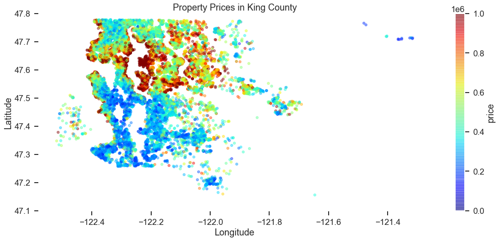

> *Figure 1*

To explore which features may have the highest impact on price, we
created the correlation matrix *Figure 2*.

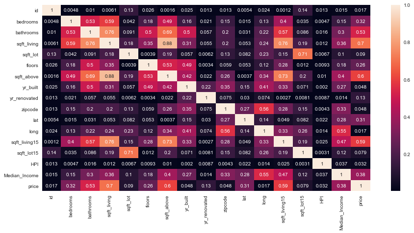

> *Figure 2*

Next is a scatter matrix *Figure 3* of some of the more highly
correlated features in order to visualize the relationship between
individual predictors:

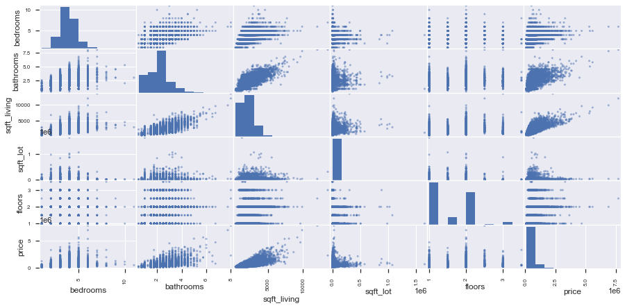

> *Figure 3*

## **Baseline Model**

Our first model incorporates only square footage of the living space as
the sole predictor. This model's prediction vs true sale price is
plotted in *Figure 4:*

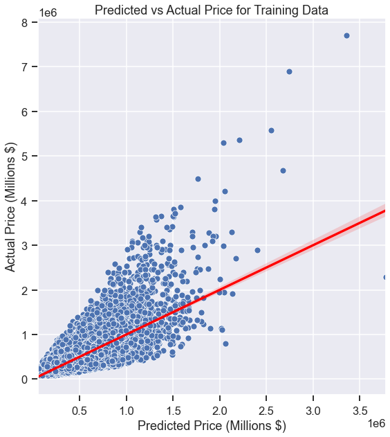

> *Figure 4*

This model is clearly ineffective --- we chose to use the metric of
**Median Absolute Percent Error (MDAPE),** which is 28.51% for this
simple model. However, it will serve as a starting point for
improvements.

## **Feature Engineering**

We added several features to our model that were not included in the
original dataset, such as median household income of each zip code,
distance to the downtown Seattle area, and the housing price index --- a
measure of the general US economic environment during which the house
was sold.

## **Log Scaling**

Upon examination, some features of the dataset appear to be heavily
skewed. For this reason, we used log-scaling on some target predictors
to create more normally distributed features. *Figure 5* shows the
square feet variable before and after log-scaling, and *Figure 6* shows
the same for our target variable, sale price.

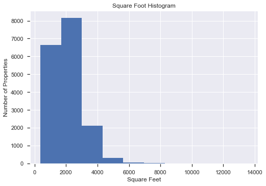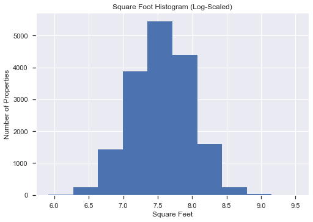

> *Figure 5*

&nbsp;
&nbsp;
&nbsp;
&nbsp;

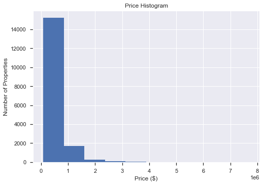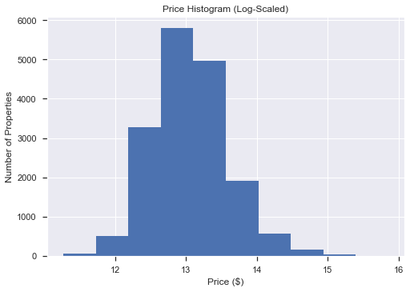

> *Figure 6*

## **Polynomial Regression**

We also investigated the effect of adding polynomial terms to the
regression model as some of the behavior was clearly nonlinear. *Figure
7* shows our MDAPE vs degree of polynomial, and we conclude that the
minimum possible error occurs at a degree of 4. Because of this, our
final model will incorporate a quartic function.

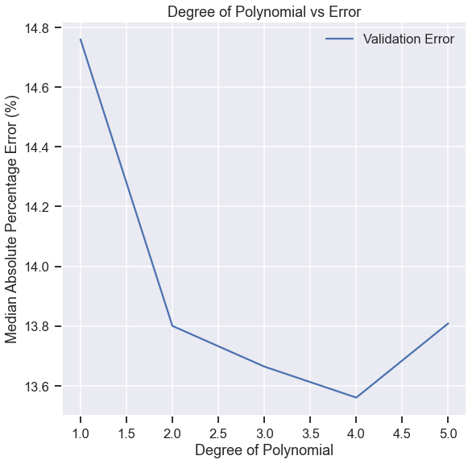

> *Figure 7*

## **Final Model**

*Figure 8* contains our final model, including our engineered features,
log scaling, and polynomic terms. The MDAPE for this model is 11.67% ---
A major improvement!

​​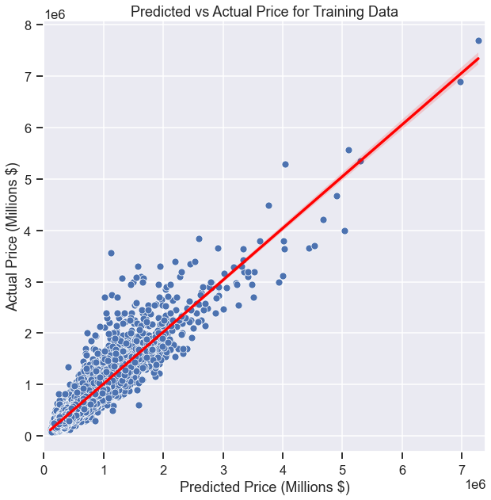
> *Figure 8*

## **Testing on Unseen Data**

Finally, we want to test our model's predictive power against data that
it has not been exposed to before. *Figure 9* shows our model's
predictions vs true sale price for the training data (blue) and the
testing data (red). Our model's MDAPE was comparable on the testing
data, at 12.63%. This may indicate some minor overfitting which will be
addressed in future iterations.

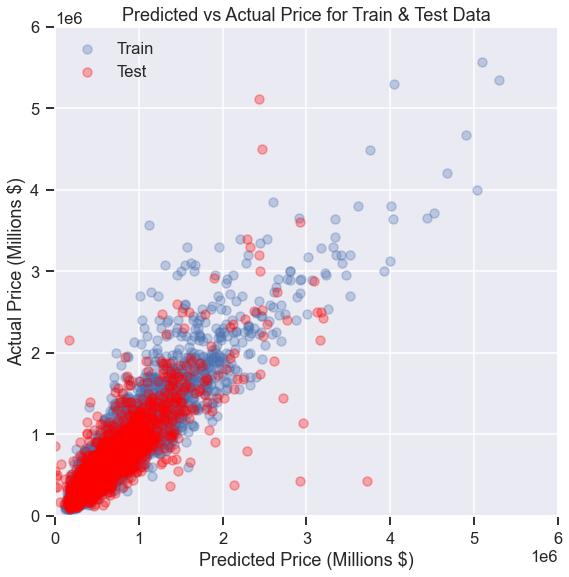
>*Figure 9*

## **Conclusions**

We were able to improve from a baseline single linear regression model
MDAPE of \~28% to a final model MDAPE of \~12%. This final model was a
polynomial regression of degree 4, with engineered features, and
log-scaling of both predictor and target variables. 

[Full Jupyter Notebook](https://github.com/LindstromKyle/DSC-Flatiron-Project-2/blob/main/Final_Notebook.ipynb)  

[Non Technical Presentation](https://github.com/LindstromKyle/DSC-Flatiron-Project-2/blob/main/Project_2_Presentation.pdf)  

